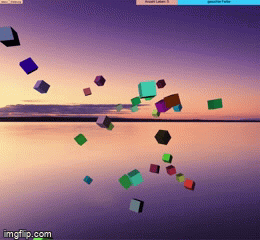
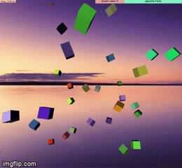

# 3DColorpicerkGame

DESCRIPTION
This is a little Game, where the Player has a an certain amount of threedimensional cubes floating on screen. Each cube has a random color and the challenge is, to find the cube with the color portrayed on the upper right corner. The goal is to click on the right color without loosing the given amount of lives (for each click on a wrong cube a life is lost).
To add additional complexity, the cubes change their shape and size when the mouse hoovers over them.
Furthermore there are various amounts of Cubes appearing on the screen and three Levels of difficulties. 

